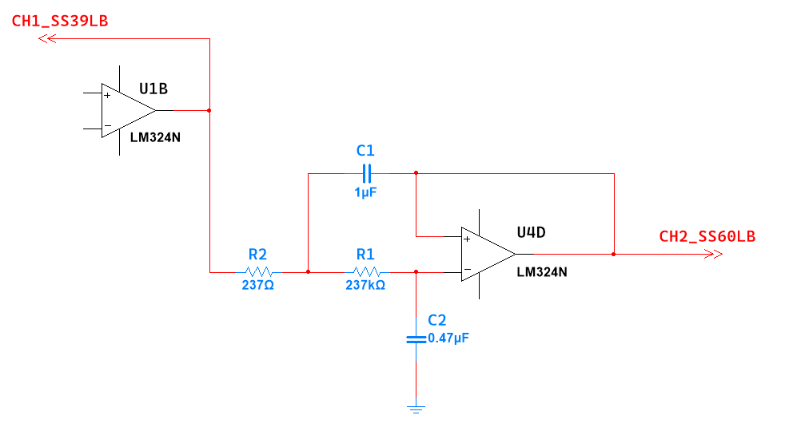
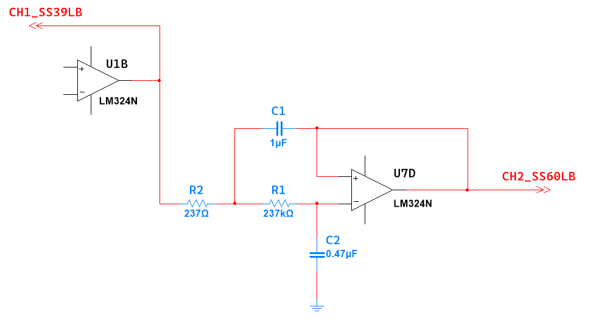
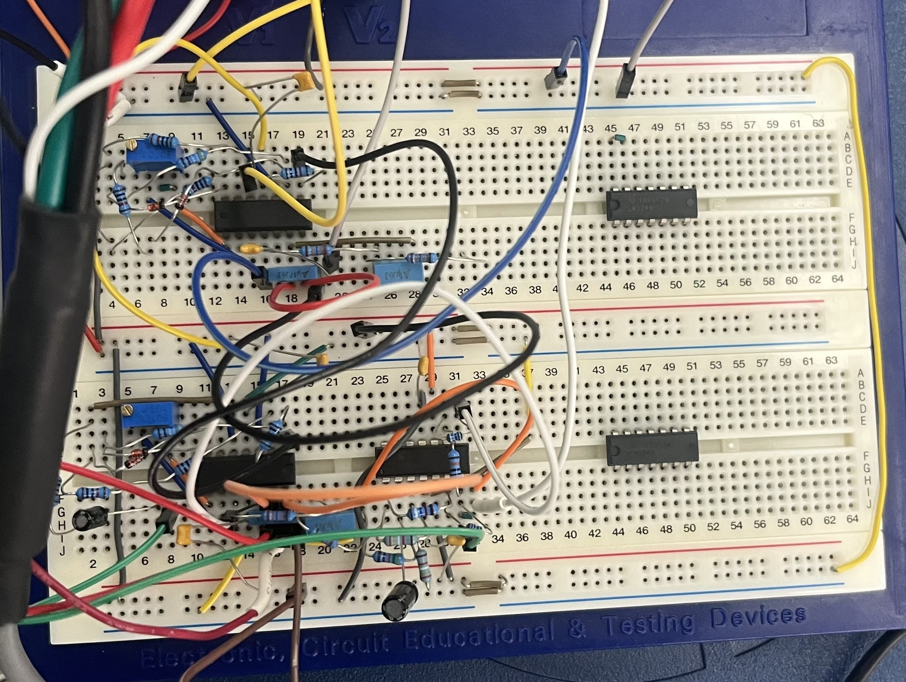

# Laboratory 9 — Robotic Signal Smoothing
## 1 Hz Low-Pass Filter (RMS Envelope Detector)

---
## Group Information

#### Group 2 — Team Members

| Name | GitHub Profile |
|---|---|
| Mangali, Ma. Kristina Cassandra S. | [GitHub](#) |
| Nueva, Juliana Kyle L. | [GitHub](#) |
| Pomarejos, Sophia Moira Leigh M. | [GitHub](#) |
| Valencia, Pearl Marie N. | [GitHub](#) |

---
## Module Objectives

This laboratory activity aims to:

- To construct two 1 Hz Low Pass filters to produce two usable waveforms to control the EMG-powered robotic arm.
- Use the square wave generator built in Lab 1 as a test signal to determine the frequency response of the filters. 

---
##  BIOPAC Documentation & Data

### Circuit Function

<p align="justify" style="text-indent: 50px;">
The circuit used in this laboratory functions as a 1 Hz low-pass filter for the EMG-powered robotic arm system. Its main role is to process the output from the absolute value circuit by reducing the fast variations present in the rectified EMG signal. Since EMG signals naturally contain rapid changes and high-frequency components, they cannot be directly used as stable control inputs for a robotic arm. The low-pass filter helps convert these changing signals into a smoother waveform that better represents the general level of muscle activity.
<p/>

<p align="justify" style="text-indent: 50px;">
In the robotic arm system, this filtered signal becomes more suitable for controlling the servomotors. The 1 Hz low-pass filter behaves similarly to an RMS conversion, where the filtered rectified EMG signal becomes proportional to the average EMG amplitude over approximately one-second intervals. This means that instead of responding to every small fluctuation in the EMG signal, the circuit produces a slower and more usable control signal that reflects the strength of muscle activation.
<p/>

>#### Engineering Purpose

<p align="justify" style="text-indent: 50px;">
The engineering purpose of the RMS envelope detector, represented by the 1 Hz low-pass filter in this laboratory, is to transform the rectified EMG signal into a smoother and more usable control signal for the robotic arm. Since EMG signals contain rapid fluctuations and high-frequency components, direct use of the raw signal may result in unstable or inconsistent actuator movement. By filtering the signal, the circuit reduces unwanted high-frequency variations and allows the system to respond mainly to the general level of muscle activity. This produces a more stable control input that is better suited for servomotor operation, since the BIOPAC manual notes that the robotic arm’s servomotor control signals must be limited to frequencies no greater than 1 Hz.
	
<p align="justify" style="text-indent: 50px;">
The circuit also functions similarly to an RMS envelope detector because it does not follow every small change in the EMG waveform. Instead, it produces an output that reflects the average EMG amplitude over a short time interval. This helps convert raw EMG activity into usable motion control data, allowing the robotic arm to respond more smoothly to muscle activation.


>#### Biomedical Relevance

<p align="justify" style="text-indent: 50px;">
In biomedical instrumentation, signal conditioning is necessary because biological signals such as EMG are often small, noisy, and variable. For an EMG-powered robotic arm, the system must interpret muscle activity accurately before it can produce a safe and reliable mechanical response. The low-pass filter supports this process by reducing noise and smoothing the signal, allowing the device to focus on the meaningful changes in muscle contraction rather than on fast and irregular signal fluctuations.
	
<p align="justify" style="text-indent: 50px;">
This is relevant to human-machine interfacing because the quality of the conditioned signal directly affects how well the robotic arm responds to the user’s intention. A smoother EMG control signal can help prevent sudden or unstable actuator movements, improving both safety and control reliability. In this way, the circuit demonstrates the importance of signal conditioning in biomedical systems that translate physiological activity into functional assistive movement.


---
###  Schematics & Waveforms

>#### Circuit Schematics

<div align="center">

<table>
  <tr>
    <td align="center">
      
    </td>
    <td align="center">
      
    </td>
  </tr>
  <tr>
    <td align="center"><b>EMG Channel 1 Low-Pass Filter Schematic Using U4D</b></td>
    <td align="center"><b>EMG Channel 2 Low-Pass Filter Schematic Using U7D</b></td>
  </tr>
  <tr>
    <td colspan="2" align="center">
      
    </td>
  </tr>
  <tr>
    <td colspan="2" align="center"><b>Actual Circuit</b></td>
  </tr>
</table>

</div>

<p align="justify" style="text-indent: 50px;">
The schematic shows the 1 Hz low-pass filter circuit used for both EMG Channel 1 and EMG Channel 2. Channel 1 uses the U4D section of the LM324N operational amplifier, while Channel 2 uses the U7D section. Both circuits have the same resistor-capacitor arrangement, which filters the incoming EMG-related signal and reduces rapid fluctuations before the output is recorded through CH2_SS60LB.
	
<p align="justify" style="text-indent: 50px;">
The actual circuit, on the other hand, shows the breadboard implementation of the same low-pass filter design. It includes the LM324N ICs, resistors, capacitors, and jumper wires used to construct the two EMG filter channels. Although the breadboard appears more complex than the schematic, it follows the same function of smoothing the signal for BIOPAC waveform analysis.


---

> #### BIOPAC Waveform Outputs

**EMG Channel 1 Low Pass:**

<p align="center">
  
</p>

_Figure 1_

The image above displays a 0.5Vpp square wave input (red) is processed by a 1 Hz low-pass filter, which slowly smooths the sharp transitions into a sinusoidal-shaped output (blue), emulating a real-time RMS detector that reflects average signal amplitude over time, demonstrating how the filter removes high-frequency components while producing a slow, stable control signal suitable for driving servomotors in a robotic arm.

**EMG Channel 1 Waveform Selection from 10% to 90%:**

<p align="center">
  
</p>

_Short Description_

**EMG Channel 2 Low Pass:**

<p align="center">
  
</p>

_Short Description_

**EMG Channel 2 Waveform Selection from 10% to 90%:**

<p align="center">
  
</p>

_Short Description_

---

### Calculations & Frequency Response Analysis

>#### Low Pass Filter Measurements

<div align="center">

|  | P-P (mV) |
|---|---|
| **EMG Channel 1** | 512.908 mV |
| **EMG Channel 2** | 510.894 mV |

<b>Table 9.1 CH 1: 0.5Vpp Sq Wave</b>

</div>

<br>

<div align="center">

|  | P-P (mV) | Min (mV) | 10% of max. (mV)<br>(Calculate) | 90% of max. (mV)<br>(Calculate) |
|---|---|---|---|---|
| **EMG Channel 1** | 495.62 mV | -241.851 mV | -192.289 mV | 204.207 mV |
| **EMG Channel 2** | 507.614 mV | -248.306 mV | -197.545 mV | 208.547 mV |

<b>Table 9.2 CH 2: Low Pass Out</b>

</div>

---

>#### Calculations for 10% and 90% Values

<div align="center">

```text
10% Value = Min + (0.1 × P-P)

90% Value = Min + (0.9 × P-P)
```

</div>

**EMG Channel 1**

[Show calculations here]

**EMG Channel 2**

[Show calculations here]


---

>#### Low Pass Frequency Response

<div align="center">
	
 ### $f_h = \frac{0.35}{t_r}$

</div>

Where:

- $f_h$ = estimated low-pass frequency response  
- $t_r$ = rise time from 10% to 90%

<div align="center">
	
| Measurement | EMG Channel 1 | EMG Channel 2 |
|---|---|---|
| Delta T (s) | 0.349 sec | 0.346 sec |
| Low Pass Filter Frequency (Estimated) | 1.003 Hz | 1.012 Hz |

**Table 9.3**

</div>

<p align="justify" style="text-indent: 50px;">
The calculated frequency response of both low-pass filters closely matches the intended 1 Hz cutoff frequency. EMG Channel 1 produced an estimated frequency response of 1.003 Hz, while EMG Channel 2 produced 1.012 Hz. Since both values are very near 1 Hz, the results show that the filters performed according to their expected function of allowing slow signal changes to pass while reducing faster fluctuations. The small difference from the exact 1 Hz value is acceptable because actual circuit measurements are affected by practical factors such as component tolerance, breadboard connections, and minor variations in waveform reading.

<p align="justify" style="text-indent: 50px;">
Although the two low-pass filters used the same circuit design, their measurements may still differ slightly due to real-world circuit conditions. The resistors and capacitors may have small tolerance differences, and the breadboard wiring may introduce minor contact resistance or connection variations. Differences between the LM324N op-amp sections may also affect the output response. In addition, the 10% and 90% points were selected from recorded BIOPAC waveform data, so the measured rise time may not be exactly identical for both channels. These factors explain why EMG Channel 1 and EMG Channel 2 produced nearly the same frequency response, but not perfectly equal values.


>#### Gain and 3 dB Cutoff Frequency Calculations

**Gain**
<div align="center">

$$
Gain = \frac{V_{out}}{V_{in}}
$$

$$
Gain = 1
$$

</div>


_Explain pa konti: Since the circuit uses a unity-gain Sallen-Key low-pass filter configuration, the output voltage is approximately equal to the input voltage._

**Low-Pass 3 dB Cutoff Frequency Calculation**

Using:

<div align="center">

$$
f_c = \frac{1}{2\pi R\sqrt{C_1 C_2}}
$$

</div>

Given:

```text
R = 237 kΩ = 237000 Ω

C₁ = 0.47 µF = 0.47 × 10⁻⁶ F

C₂ = 1 µF = 1 × 10⁻⁶ F
```

Substitute:

<div align="center">

$$
f_c = \frac{1}{2\pi (237000)\sqrt{(0.47\times10^{-6})(1\times10^{-6})}}
$$

</div>

Calculate the Capacitor Term

<div align="center">

$$
\sqrt{(0.47 \times 10^{-6})(1 \times 10^{-6})}
$$

$$
= 6.855 \times 10^{-7}
$$

</div>

Substitute again:

<div align="center">

$$
f_c =
\frac{1}{2\pi (237000)(6.855 \times 10^{-7})}
$$

</div>

Final Answer:

<div align="center">

$$
f_c \approx 0.98 \text{ Hz}
$$

</div>


_Explain pa kontii Therefore, the theoretical 3 dB cutoff frequency of the low-pass filter is approximately 1 Hz.
_

---
## Video Presentation

### Demonstration Video

Insert your presentation/demo link below.

- 📺 YouTube: [Insert Link Here](#)
- 📁 Vimeo: [Insert Link Here](#)

---
## Group Conclusion

Provide a concise 1–2 paragraph summary discussing:

- Success of the RMS envelope detector implementation
- Performance of the 1 Hz low-pass filters
- Importance of signal conditioning in biomedical robotics
- Relevance to safe and accurate robotic arm control systems

---

## References

BIOPAC Systems, Inc. (2020). *BSL PRO Lesson H40: EMG-Powered Robotic Arm*. BIOPAC Systems, Inc.

---
## Repository Structure

```bash
LABORATORY-9/
│
├── README.md
├── schematics/
├── waveform-data/
├── fft-analysis/
├── calculations/
├── presentation/
└── documentation/
```

---
